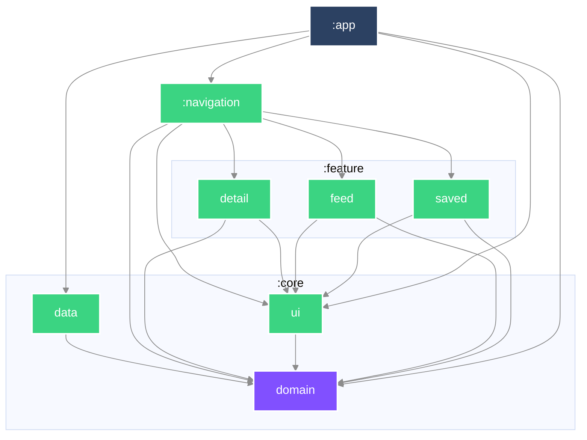
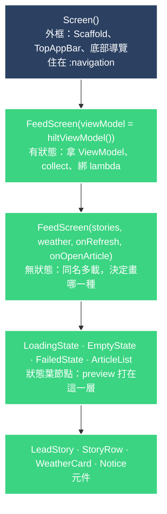

# Mosaic

一份由彼此不相像的來源組成的 feed——文章、天氣、電影——每一種對「多久算過期」
都有自己的看法。

> **目前狀態：五個 must-have 都在了，並在模擬器上逐一走過。**
> 清單、分頁、內頁、存起來、**存起來的文章沒有網路也打得開**（飛航模式實測）、
> 天氣卡與三日預報（形狀完全不同的第二種來源）、以及各來源各自的 freshness。
> loading／empty／error／offline 各有自己的畫面。下拉更新有了。
> 卡片點開文章是一次容器變形，圖片與標題是共享元素。
> **畫面本身仍然沒有自動化測試**——轉場與版面的驗收方式是人在裝置上看，
> 這是刻意的取捨（見下方延後表與 `DECISIONS.md` 20）。
> **第三種來源（TMDB 熱門電影）的程式與測試在了，但那一列還沒有人配著真資料看過**——
> 沒有 token 的 build 不會顯示它，這是刻意的（`DECISIONS.md` 40）。
> 還沒有的：搜尋與篩選。
> 這份 README 隨程式碼一起長，每個 commit 都只寫當下為真的事。

## 執行

```bash
./gradlew :app:installDebug
```

從乾淨的 checkout 直接建置，不需要任何設定步驟。最低支援 SDK 24。

**電影那一列需要一把鑰匙，而它是選配的。** 想看它就在 `local.properties` 加一行：

```properties
tmdb.token=<TMDB v4 read access token>
```

那個檔案 git 忽略，所以 token 不會進版控。**沒加也照樣建置、照樣跑**——
feed 就只有兩種來源，那一列不出現。不是錯誤畫面，不是佔位圖，是不存在，
跟天氣讀不到時沒有那張卡同一個處置（`DECISIONS.md` 40）。

## 程式碼怎麼擺

| 模組 | 內容 |
|---|---|
| `:core:domain` | 純 Kotlin。領域模型與 repository 介面。不相依於任何東西。 |
| `:core:data` | 網路、持久化、映射。實作 domain 宣告的介面。 |
| `:core:ui` | 主題。`:app` 在最上面套一次，底下的畫面透過 Compose 讀它，不透過 Gradle。 |
| `:feature:feed` | 組合後的 feed。 |
| `:feature:detail` | 單篇文章。 |
| `:feature:saved` | 存起來離線閱讀的文章。 |
| `:navigation` | 哪個畫面通往哪個畫面：NavKey、`entryProvider`、back stack 操作，以及上下兩條 bar。 |
| `:app` | 組裝與 Android 進入點。**一條 `:feature:*` 的邊都不宣告**（`DECISIONS.md` 31）。 |

相依方向一律向內。`:core:domain` 是純 Kotlin 模組、完全不相依 Android，
DTO 或 Compose 型別因此**進不去**——不是靠審查時有人注意到，是建置直接失敗。

### 模組相依圖


### 一個畫面切成幾層

官方只規定兩件事：**拿 ViewModel 的那層要跟排版的那層分開**，而且
[ViewModel 不准往下傳](https://developer.android.com/develop/ui/compose/state-hoisting)——
往下傳就沒辦法 preview。名字叫什麼不是官方的事，這裡採 Now in Android 的**同名多載**。



| 層 | 它隔開了什麼 |
|---|---|
| **外框** | 三個畫面共用一份 Scaffold，所以外觀必然一致。它住在 `:navigation`，feature 裡沒有。 |
| **有狀態** | 唯一碰得到 ViewModel 的地方。它不排版。 |
| **無狀態** | 跟上一層**同名**——「同一個畫面的兩種形態」因此是編譯器層級的事實，而不是兩個碰巧相鄰的名字。 |
| **狀態葉節點** | 每種畫面各一個具名 composable。這層存在的理由是 preview：**一張圖剛好一個狀態**，錯誤畫面不用拔網路線才看得到。 |

**層數不是固定的，是照職責長出來的。** Feed 比另外兩個多一層，因為它有下拉更新，
`PullToRefreshBox` 需要一個包裝；Detail 與 Saved 沒有外框可分，無狀態層直接就是排版層。
**對稱不是目的，每一層都要能說出自己隔開了什麼。**

### 誰把東西交給誰

整個 App 的物件組裝只有一個地方：`DataModule`。六個 `@Provides`，全部 `@Singleton`，
全部 `internal`——上面的模組拿得到介面，拿不到實作。

| 做出什麼 | 要先有什麼 | 白話 |
|---|---|---|
| `HttpClient` | — | 設定好逾時與 JSON 的 Ktor 客戶端 |
| `SpaceflightNewsApi` | `HttpClient` | 唯一知道文章 API 網址與參數的類別 |
| `SavedArticlesDatabase` | app context | Room 資料庫本體 |
| `SavedArticleDao` | 資料庫 | 對那張表的查詢。**有兩個消費者** |
| `ArticleRepository` | Api ＋ Dao | 文章從哪來的仲裁：存過的先給存過的 |
| `WeatherRepository` | app context | 天氣的串流，自己決定何時再問 |

`SavedArticleDao` 有兩個消費者，是「存過的文章優先」發生在**資料層**而不是畫面的證據
（`DECISIONS.md` 30）。

> **互動版**：[`docs/architecture.html`](docs/architecture.html) 是同一份內容的可點版本——
> 點任一模組會highlight它的相依邊，並列出它吃什麼、誰吃它。
> GitHub 不會渲染 repo 裡的 HTML，下載後用瀏覽器開。

## 任務拆解與順序

### 怎麼拆

拆成「行為」，一個 commit 一個，每個都能獨立審查、獨立 revert。
行為指的是使用者感覺得到的改變——所以骨架那幾個 commit 標的是
`build`／`ci`／`docs` 而不是 `feat`：它們沒有改變任何可觀察的東西。

### 順序，以及為什麼

1. **骨架**——模組邊界先定，因為在它之前寫的每一個檔案事後都得搬家。
2. **文章 feed**——單一來源，從清單到內頁走完整條垂直切片。在異質內容進場之前，
   先用最單純的內容把整條路徑打通。
3. **離線儲存**——持久化，做在形狀已經穩定下來的內容上。
4. **異質 feed**——天氣與電影加入文章之中。它**刻意**排在 must-have 的最後：
   這是整份作業最難的抽象，而在還沒有真實內容可供歸納之前就先選定它，
   等於是對著猜測做設計。
5. **Freshness**——各來源各自的規則：天氣問來源，文章只在有人開口時抓。

**畫面在這個順序裡是什麼** —— 是**驗證工具**，不是終點。domain 先立，資料層次之，
畫面最後一個到——但它會**提早一次**，在第一條垂直切片打通的時候，因為那是唯一能證明
「下面那幾層真的接得起來」的方法。單元測試全綠而畫面是錯的，這件事在這個 repo 裡
發生過兩次（天氣卡因回應順序消失、detail 的 ViewModel 落在 Activity scope），
兩次都是接上畫面之後才被發現的。

所以畫面的驗收標準也不同：它寫完、看起來對，就過了。**不為它投入超過驗證所需的工。**
真正要被測試釘死的是它下面那幾層。

## Freshness：什麼叫「新鮮」

作業要求 feed「保持合理新鮮」，**同時**「不要浪費使用者的行動網路」。這兩件事方向相反，
所以這裡的答案不是一個數字，是**三個**——三種來源，三種節奏。

| | 什麼時候值得再問一次 |
|---|---|
| **天氣** | **來源說的下一格**——不是一個我們挑的數字 |
| **文章** | **開 app 抓一次，下拉抓一次，其餘永不** |
| **電影** | **讀者手上的日期翻過去**——一天一次，寫進磁碟所以重開 app 不重來 |

**三個都不是憑空挑的數字。** 這是刻意的：一個挑出來的 TTL 要辯護，而這三個不用。

**文章為什麼沒有時間窗** —— 會要求第一頁的只有兩件事：app 啟動，和讀者下拉。
兩個都是有人開口要看。往下捲不會（那走伺服器給的 `next` 連結），回到畫面也不會
（串流常駐）。所以一個時間窗防的是一種不存在的浪費（詳見 `DECISIONS.md` 25）。

**天氣：問來源，不要猜。** Open-Meteo 每筆讀數自己帶時間戳與步長：

```json
"current": { "time": "2026-09-01T12:30", "interval": 900, "temperature_2m": 30.4 }
```

`interval: 900` 秒＝來源每 15 分鐘才產生一個新值。所以「下次值得問」不需要辯護，
**它是來源自己說的**。實測 12:5x 去問，拿回來的是 12:30 那一格——**取得的當下它就
已經二十幾分鐘舊了**。原本 10 分鐘的固定窗因此保證有三分之一的請求必然拿回同一個
數字。那不是新鮮度政策，那是浪費。

天真的算法會壞：`measuredAt + interval` 在上例算出 12:45，那已經是過去，於是立刻
過期 → 再問 → 還是 12:30 → 無窮迴圈。來源有發布延遲。正確的是推到**現在之後的
第一格**，它會順著來源的延遲自我校正，永遠不會問得比來源產出更快（`DECISIONS.md` 23）。

**電影：來源只說了一個字，而它在位址裡。** TMDB 的回應**沒有**天氣那種欄位——
沒有時間戳、沒有 interval、沒有值得信任的快取語意。但被問的位址是
`/3/trending/movie/day`，而 `{time_window}` 的另一個合法值是 `week`。
**「多久換一次」還是來源說的，只是寫在請求而不是回應裡。** 所以規則是一天一次。

那份清單連同它被算出來的日期一起寫進 `cacheDir`。**不寫下來的話「一天一次」等於
「一次啟動一次」**，那就是文章那條規則換個名字，而午餐前開五次 app 就會問五次。

**下拉不會碰它。** 下拉的意思是「給我更新的報導」，它不會讓 TMDB 重算今天的榜單——
把下拉接上去，等於用讀者的流量換一份一模一樣的清單。這是三條規則裡唯一
**刻意不理會使用者手勢**的一條。

已知的缺陷寫在這裡而不是藏起來：TMDB 沒有文件說它在哪個小時翻日，所以本地午夜後
的第一次請求可能拿回昨天那份，**一天最多浪費一次**。這比天氣原本那個固定十分鐘窗
好得多——那個窗保證三分之一的請求拿回同一個數字（詳見 `DECISIONS.md` 40）。

**陳舊對三者造成的錯誤種類不同**：

| | 陳舊產生什麼 | 讀者因此做錯什麼 |
|---|---|---|
| 天氣 | **謊**——卡片宣稱「現在 30°」，實際 25° | 穿錯、沒帶傘 |
| 文章 | **缺**——少了最新幾篇 | 沒有。顯示出來的每一篇仍然是真的 |
| 電影 | **錯位**——昨天的排名，片子本身沒變 | 沒有。看到的每一部確實都在榜上 |

天氣需要跟著格線，是因為它被呈現成「現在」，過期就是假的。文章不需要窗，
是因為過期只是少，不是錯——實測同一篇文章 3.5 小時前存下的六個顯示欄位與現在
的 API 完全相同，報導類文章極少改動，而我們顯示的只是摘要。電影落在中間：
它像天氣一樣宣稱「現在正熱」，但一天內的排名變動不會讓任何一部片變成假的，
所以它跟得起一格一天的格線，不需要更細。

**只寫下第一頁** —— 打開 app 要的就是清單的頂端，那是最值得省下的一次請求。
「下一頁」是對「我手上這批之後是什麼」的提問，用一小時前的答案回它，
得到的不是下一頁，是另一份清單。

**失敗時用舊的** —— 網路壞掉而手上有一頁時，那一頁贏。這是它**唯一**的用途：
它不參與「要不要打網路」的判斷，只在請求失敗時被讀。

**下拉時清單不會消失** —— 正在讀的東西不該為了證明有在載入而被拿走。

**「新鮮」量的是什麼** —— 是**多久不再問一次**，不是「顯示的資料最多多舊」。
天氣尤其如此：Open-Meteo 的即時值來自每十五分鐘一步的模式資料，剛抓回來的讀數
本身可能就描述著更早一點的時刻。政策管得住的是發問的頻率。

**分頁讀的是「那一刻的清單」** —— 第一頁帶 `published_at_lte=<現在>`，伺服器把這個條件
寫進它產生的每一個 `next` 連結，所以整趟瀏覽的 offset 都指向同一份清單。
沒有這個，新文章會從頂端把所有東西往下推，「第 21 筆」就不再是原本那一筆。
這是一個**時間截點而不是伺服器發的 snapshot**：裝置時鐘偏差與事後回填仍然擋不住，
所以它大幅降低而非消除位移，去重那一層因此留著（詳見 `DECISIONS.md` 16）。

**還沒做的** —— `updated_at`（伺服器說文章何時被改過，可以讓「新鮮」更精確而不必重抓整頁）。

### 作業要求的完成度

| 要求 | 狀態 |
|---|---|
| 分頁載入 | ✅ 跟隨伺服器給的 `next` 連結，捲到底前三項自動載入，失敗後**不**自動重試 |
| detail 畫面 | ✅ |
| save／unsave | ✅ 存成 Room 的一張表，清單是一個可觀察的查詢；上一版的 JSON 檔開一次就匯進來（`DECISIONS.md` 29 取代 12） |
| 存起來的可離線閱讀 | ✅ 網路失敗時改用存下來的那一份 |
| 異質 feed（第二種來源） | ✅ Open-Meteo 的天氣，同一個清單裡形狀明顯不同的一張卡，含三日預報與各日的天氣圖示 |
| 異質 feed（第三種來源） | ⚠️ TMDB 熱門電影，橫向捲的一列海報＋標題＋評分。程式與測試在了，**但沒有人配著真資料看過**；沒有 token 的 build 不顯示它 |
| freshness policy | ✅ 天氣跟來源的格線；文章開 app 抓一次、下拉抓一次；電影一天一次且寫進磁碟；失敗時用寫下的那份 |
| loading／empty／error／offline | ✅ 五個狀態（另有 unreadable），ViewModel 有測試；畫面本身沒有 |
| 全部在模擬器上走過 | ✅ 五個 must-have 逐一實跑，離線閱讀用飛航模式驗過。**電影那一列不在這句話涵蓋範圍內** |

### 刻意延後了什麼

發生時當下補寫，而不是最後回頭重建。

| 延後的東西 | 為什麼現在不做 | 什麼時候做 |
|---|---|---|
| freshness 需要的 `updated_at` 與「本機何時抓的」 | 沒有行為在用的欄位是投機——加了也沒有測試能證明它對 | 跟著 freshness 那個行為一起進來 |
| 型別化的失敗（offline／HTTP 錯誤／回應無法解讀） | 轉換點在 repository，而 repository 還不存在 | repository 那個 commit |
| 自動重試 | 作業要求不浪費行動網路，而重試做錯正是最快的浪費方式 | 有遙測能證明它值得之後 |
| base URL 設定化 | 只有一個公開 endpoint，注入設定現在只會增加樣板 | 有第二個環境時 |
| 被丟掉的資料列要報給誰 | 原因已經帶回呼叫端，但只有數量被用到 | 有遙測或 log 的去處之後 |
| 磁碟滿與資料庫毀損這兩條路徑 | JVM 測試裡沒有能觸發它們的縫——檔案版還能靠占住寫入路徑假造第一種，SQLite 沒有對應的做法（`DECISIONS.md` 29） | 有裝置上的測試，或 SQLite driver 變成可注入之後 |
| 畫面的自動化測試 | Compose 測試需要裝置或 Robolectric，兩者都還沒有；寫一個從未執行過的測試不算證據 | 接上 `connectedDebugAndroidTest` 或 Robolectric 之後 |
| 搜尋／過濾 | nice-to-have。必備項目與它們的可驗證性優先 | 必備全部在裝置上驗過之後 |
| TMDB 圖片 base URL 改成從 `/3/configuration` 取得 | 那是「抓一次、存起來、幾天檢查一次」的一整條快取路徑，換來的是一個沒變過的字串；現在寫死並把代價寫在 `DECISIONS.md` 40 | TMDB 真的動了 CDN，或需要不只一種尺寸時 |
| 電影那一列的裝置驗收 | 這台機器沒有網路可以打 TMDB，海報從未真的載入過 | 下一次能在裝置上配著 token 看的時候 |
| 轉場的兩處未完成：那排出處小字沒有跟著飛；文章的全螢幕底色在共享容器之外，所以退場時它的邊緣比目標卡片大 | 兩者都已定位（底色那層是 `EdgeToEdgeScreen` 的 `Surface`，套在 `sharedArticleCard` 外面），但這個專案沒有截圖測試，改動只能靠人在裝置上看——當下沒有時間跑完整輪驗證 | 有 Compose 截圖測試，或下一次能在裝置上逐幀確認時 |

## 這份專案是怎麼做出來的

[`AGENTS.md`](AGENTS.md) 描述開發迴圈，以及人與 AI 的分工落在哪裡。
[`DECISIONS.md`](DECISIONS.md) 記錄審查者會質疑的每一個選擇。
[`AI_USAGE.md`](AI_USAGE.md) 記錄 agent 實際產出了什麼、哪些被否決
（逐輪的完整審查紀錄在 [`docs/ai-review-log.md`](docs/ai-review-log.md)）。
[`docs/git-conventions.md`](docs/git-conventions.md) 是 commit 與分支的慣例。