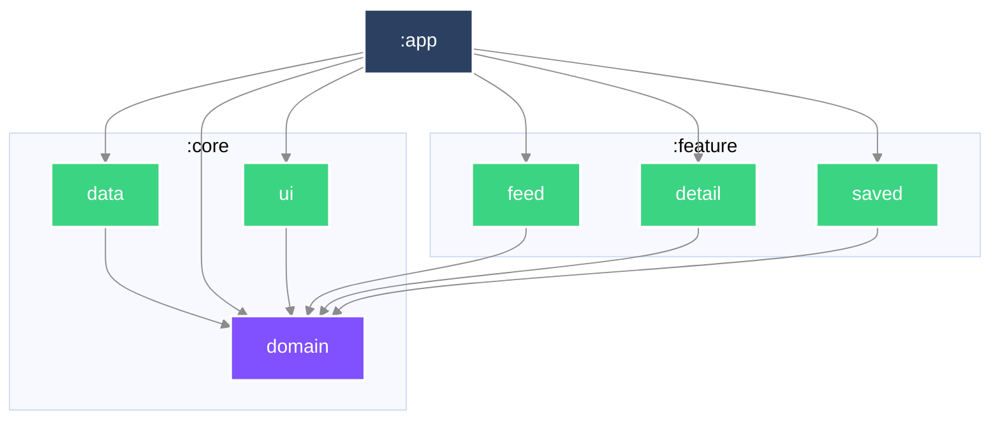

# Mosaic

一份由彼此不相像的來源組成的 feed——文章、天氣、電影——每一種對「多久算過期」
都有自己的看法。

> **目前狀態：六個 must-have 都在了。**
> 清單、分頁、內頁、存起來、**存起來的文章沒有網路也打得開**、
> 天氣卡（形狀完全不同的第二種來源）、以及各來源各自的 freshness。
> loading／empty／error／offline 四種狀態各有自己的畫面。
> **尚未在實機驗證過**：所有證據來自單元測試與建置，畫面本身還沒有自動化測試（見下方延後表）。
> 還沒有的：下拉更新、第三種來源。
> 這份 README 隨程式碼一起長，每個 commit 都只寫當下為真的事。

## 執行

```bash
./gradlew :app:installDebug
```

從乾淨的 checkout 直接建置，不需要任何設定步驟。最低支援 SDK 24。

## 程式碼怎麼擺

| 模組 | 內容 |
|---|---|
| `:core:domain` | 純 Kotlin。領域模型與 repository 介面。不相依於任何東西。 |
| `:core:data` | 網路、持久化、映射。實作 domain 宣告的介面。 |
| `:core:ui` | 主題。`:app` 在最上面套一次，底下的畫面透過 Compose 讀它，不透過 Gradle。 |
| `:feature:feed` | 組合後的 feed。 |
| `:feature:detail` | 單篇文章。 |
| `:feature:saved` | 存起來離線閱讀的文章。 |
| `:app` | 組裝、導覽、Android 進入點。 |

相依方向一律向內。`:core:domain` 是純 Kotlin 模組、完全不相依 Android，
DTO 或 Compose 型別因此**進不去**——不是靠審查時有人注意到，是建置直接失敗。

### 模組相依圖


## 任務拆解與順序

### 怎麼拆

拆成「行為」，一個 commit 一個，每個都能獨立審查、獨立 revert。
行為指的是使用者感覺得到的改變——所以骨架那幾個 commit 標的是
`build`／`ci`／`docs` 而不是 `feat`：它們沒有改變任何可觀察的東西。

### 順序，以及為什麼

1. **骨架**——模組邊界先定，因為在它之前寫的每一個檔案事後都得搬家。
2. **文章 feed**——單一來源，從清單到內頁走完整條垂直切片。在異質內容進場之前，
   先用最單純的內容把整條路徑打通。
3. **離線儲存**——持久化，做在形狀已經穩定下來的內容上。
4. **異質 feed**——天氣與電影加入文章之中。它**刻意**排在 must-have 的最後：
   這是整份作業最難的抽象，而在還沒有真實內容可供歸納之前就先選定它，
   等於是對著猜測做設計。
5. **Freshness**——各來源各自的過期規則，包含在計費網路上退讓。

**畫面在這個順序裡是什麼** —— 是**驗證工具**，不是終點。domain 先立，資料層次之，
畫面最後一個到——但它會**提早一次**，在第一條垂直切片打通的時候，因為那是唯一能證明
「下面那幾層真的接得起來」的方法。單元測試全綠而畫面是錯的，這件事在這個 repo 裡
發生過兩次（天氣卡因回應順序消失、detail 的 ViewModel 落在 Activity scope），
兩次都是接上畫面之後才被發現的。

所以畫面的驗收標準也不同：它寫完、看起來對，就過了。**不為它投入超過驗證所需的工。**
真正要被測試釘死的是它下面那幾層。

## Freshness：什麼叫「新鮮」

作業要求 feed「保持合理新鮮」，**同時**「不要浪費使用者的行動網路」。這兩件事方向相反，
所以這裡的答案不是一個數字，是**兩個**。

| | 一般連線 | 計費連線 |
|---|---|---|
| 文章 | 15 分鐘 | 60 分鐘 |
| 天氣 | 10 分鐘 | 30 分鐘 |

**為什麼是兩個數字** —— 用一個數字就得選邊：短了浪費資料，長了資料過期。
兩個數字讓它變成「同一個問題在兩種情境下的兩個答案」。在不用付錢的連線上，
唯一的考量是新鮮度；在行動網路上，每一次更新都是別人帳單上的一筆，
而「feed 晚了 15 分鐘」是遠比「安靜地花掉你的流量」小的問題。

**為什麼天氣比文章短** —— 作業自己提示了：天氣以分鐘變化，文章以小時變化。
來源也這麼說——Open-Meteo 以 15 分鐘為間隔回報。這就是「一個 TTL 給全部」擋不住的地方：
同一個數字要嘛對慢的那個太浪費，要嘛讓快的那個顯示過期。

**為什麼文章是 15 分鐘** —— 文章是**以小時為單位**發布的，不是以分鐘。
15 分鐘短到「午餐後回來會看到新的」，長到「在 app 之間切來切去不花錢」。
作業提示天氣以分鐘變化、文章以小時變化——所以這個數字**屬於來源**，
異質內容進來時天氣會有自己的一組（`Cadence` 就是為了這件事存在）。

**只快取第一頁** —— 打開 app 要的就是清單的頂端，那是最值得省下的一次請求。
「下一頁」是對「我手上這批之後是什麼」的提問，用一小時前的答案回它，
得到的不是下一頁，是另一份清單。

**失敗時用舊的** —— 網路壞掉而手上有一頁時，那一頁贏。這跟「存起來的文章可離線閱讀」
是同一個承諾，只是低一層。

**兩個防呆寫死在型別裡** —— 計費的窗不得短於一般的窗（否則政策比沒有政策更耗流量），
窗不得為零。未來的時間戳視為新鮮，因為手機的時鐘會變，而把它當錯誤的後果是
「在時鐘追上之前不停重抓」——恰好是最耗流量的行為。

**讀者可以推翻它** —— 下拉更新會強制打網路，計費連線也一樣。政策存在的目的是
「不要在沒被要求的情況下花掉別人的流量」，它對「被要求的時候」沒有話語權。
下拉時清單不會消失——正在讀的東西不該為了證明有在載入而被拿走。

**還沒做的** —— `updated_at`（伺服器說文章何時被改過，可以讓「新鮮」更精確而不必重抓整頁）；
以及 offset 游標在清單變動時會漏掉文章（重複已經擋掉了，遺漏擋不掉）。

### 作業要求的完成度

| 要求 | 狀態 |
|---|---|
| 分頁載入 | ✅ 跟隨伺服器給的 `next` 連結，捲到底前三項自動載入，失敗後**不**自動重試 |
| detail 畫面 | ✅ |
| save／unsave | ✅ 存成一個 JSON 檔（`DECISIONS.md` 12） |
| 存起來的可離線閱讀 | ✅ 網路失敗時改用存下來的那一份 |
| 異質 feed（第二種來源） | ✅ Open-Meteo 的天氣，同一個清單裡形狀明顯不同的一張卡 |
| freshness policy | ✅ 兩個時間窗（一般／計費），只快取第一頁，失敗時用舊的 |
| loading／empty／error／offline | ✅ 五個狀態（另有 unreadable），ViewModel 有測試；畫面本身沒有 |

### 刻意延後了什麼

發生時當下補寫，而不是最後回頭重建。

| 延後的東西 | 為什麼現在不做 | 什麼時候做 |
|---|---|---|
| freshness 需要的 `updated_at` 與「本機何時抓的」 | 沒有行為在用的欄位是投機——加了也沒有測試能證明它對 | 跟著 freshness 那個行為一起進來 |
| 型別化的失敗（offline／HTTP 錯誤／回應無法解讀） | 轉換點在 repository，而 repository 還不存在 | repository 那個 commit |
| 自動重試 | 作業要求不浪費行動網路，而重試做錯正是最快的浪費方式 | 先有 freshness 與計費網路判斷，再談重試 |
| base URL 設定化 | 只有一個公開 endpoint，注入設定現在只會增加樣板 | 有第二個環境時 |
| 被丟掉的資料列要報給誰 | 原因已經帶回呼叫端，但只有數量被用到 | 有遙測或 log 的去處之後 |
| 畫面的自動化測試 | Compose 測試需要裝置或 Robolectric，兩者都還沒有；寫一個從未執行過的測試不算證據 | 接上 `connectedDebugAndroidTest` 或 Robolectric 之後 |
| `:core:ui` 裡的共用 composable | 目前只有主題。三個 feature 各自畫自己的卡片，等到真的有兩個地方要同一個元件時再搬進去 | 有第二個共用元件時 |
| offset 游標會漏掉文章 | 去重擋得住重複，擋不住遺漏；要修需要 snapshot 或 keyset 游標 | API 提供游標，或改成整份 snapshot |

## 這份專案是怎麼做出來的

[`AGENTS.md`](AGENTS.md) 描述開發迴圈，以及人與 AI 的分工落在哪裡。
[`DECISIONS.md`](DECISIONS.md) 記錄審查者會質疑的每一個選擇。
[`AI_USAGE.md`](AI_USAGE.md) 記錄 agent 實際產出了什麼、哪些被否決。
[`docs/git-conventions.md`](docs/git-conventions.md) 是 commit 與分支的慣例。