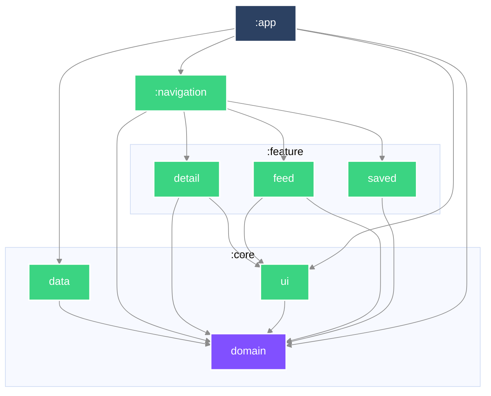

# Mosaic

一份由彼此不相像的來源組成的 feed——文章、天氣、電影——每一種對「多久算過期」
都有自己的看法。

> **目前狀態：六個 must-have 都在了。**
> 清單、分頁、內頁、存起來、**存起來的文章沒有網路也打得開**、
> 天氣卡（形狀完全不同的第二種來源）、以及各來源各自的 freshness。
> loading／empty／error／offline 四種狀態各有自己的畫面。
> **尚未在實機驗證過**：所有證據來自單元測試與建置，畫面本身還沒有自動化測試（見下方延後表）。
> 還沒有的：下拉更新、第三種來源。
> 這份 README 隨程式碼一起長，每個 commit 都只寫當下為真的事。

## 執行

```bash
./gradlew :app:installDebug
```

從乾淨的 checkout 直接建置，不需要任何設定步驟。最低支援 SDK 24。

## 程式碼怎麼擺

| 模組 | 內容 |
|---|---|
| `:core:domain` | 純 Kotlin。領域模型與 repository 介面。不相依於任何東西。 |
| `:core:data` | 網路、持久化、映射。實作 domain 宣告的介面。 |
| `:core:ui` | 主題。`:app` 在最上面套一次，底下的畫面透過 Compose 讀它，不透過 Gradle。 |
| `:feature:feed` | 組合後的 feed。 |
| `:feature:detail` | 單篇文章。 |
| `:feature:saved` | 存起來離線閱讀的文章。 |
| `:navigation` | 哪個畫面通往哪個畫面：NavKey、`entryProvider`、back stack 操作，以及上下兩條 bar。 |
| `:app` | 組裝與 Android 進入點。**一條 `:feature:*` 的邊都不宣告**（`DECISIONS.md` 31）。 |

相依方向一律向內。`:core:domain` 是純 Kotlin 模組、完全不相依 Android，
DTO 或 Compose 型別因此**進不去**——不是靠審查時有人注意到，是建置直接失敗。

### 模組相依圖


## 任務拆解與順序

### 怎麼拆

拆成「行為」，一個 commit 一個，每個都能獨立審查、獨立 revert。
行為指的是使用者感覺得到的改變——所以骨架那幾個 commit 標的是
`build`／`ci`／`docs` 而不是 `feat`：它們沒有改變任何可觀察的東西。

### 順序，以及為什麼

1. **骨架**——模組邊界先定，因為在它之前寫的每一個檔案事後都得搬家。
2. **文章 feed**——單一來源，從清單到內頁走完整條垂直切片。在異質內容進場之前，
   先用最單純的內容把整條路徑打通。
3. **離線儲存**——持久化，做在形狀已經穩定下來的內容上。
4. **異質 feed**——天氣與電影加入文章之中。它**刻意**排在 must-have 的最後：
   這是整份作業最難的抽象，而在還沒有真實內容可供歸納之前就先選定它，
   等於是對著猜測做設計。
5. **Freshness**——各來源各自的規則：天氣問來源，文章只在有人開口時抓。

**畫面在這個順序裡是什麼** —— 是**驗證工具**，不是終點。domain 先立，資料層次之，
畫面最後一個到——但它會**提早一次**，在第一條垂直切片打通的時候，因為那是唯一能證明
「下面那幾層真的接得起來」的方法。單元測試全綠而畫面是錯的，這件事在這個 repo 裡
發生過兩次（天氣卡因回應順序消失、detail 的 ViewModel 落在 Activity scope），
兩次都是接上畫面之後才被發現的。

所以畫面的驗收標準也不同：它寫完、看起來對，就過了。**不為它投入超過驗證所需的工。**
真正要被測試釘死的是它下面那幾層。

## Freshness：什麼叫「新鮮」

作業要求 feed「保持合理新鮮」，**同時**「不要浪費使用者的行動網路」。這兩件事方向相反，
所以這裡的答案不是一個數字，是**兩個**。

| | 什麼時候值得再問一次 |
|---|---|
| **天氣** | **來源說的下一格**——不是一個我們挑的數字 |
| **文章** | **開 app 抓一次，下拉抓一次，其餘永不** |

**兩個都不是憑空挑的數字。** 這是刻意的：一個挑出來的 TTL 要辯護，而這兩個不用。

**文章為什麼沒有時間窗** —— 會要求第一頁的只有兩件事：app 啟動，和讀者下拉。
兩個都是有人開口要看。往下捲不會（那走伺服器給的 `next` 連結），回到畫面也不會
（串流常駐）。所以一個時間窗防的是一種不存在的浪費（詳見 `DECISIONS.md` 25）。

**天氣：問來源，不要猜。** Open-Meteo 每筆讀數自己帶時間戳與步長：

```json
"current": { "time": "2026-09-01T12:30", "interval": 900, "temperature_2m": 30.4 }
```

`interval: 900` 秒＝來源每 15 分鐘才產生一個新值。所以「下次值得問」不需要辯護，
**它是來源自己說的**。實測 12:5x 去問，拿回來的是 12:30 那一格——**取得的當下它就
已經二十幾分鐘舊了**。原本 10 分鐘的固定窗因此保證有三分之一的請求必然拿回同一個
數字。那不是新鮮度政策，那是浪費。

天真的算法會壞：`measuredAt + interval` 在上例算出 12:45，那已經是過去，於是立刻
過期 → 再問 → 還是 12:30 → 無窮迴圈。來源有發布延遲。正確的是推到**現在之後的
第一格**，它會順著來源的延遲自我校正，永遠不會問得比來源產出更快（`DECISIONS.md` 23）。

**陳舊對兩者造成的錯誤種類不同**：

| | 陳舊產生什麼 | 讀者因此做錯什麼 |
|---|---|---|
| 天氣 | **謊**——卡片宣稱「現在 30°」，實際 25° | 穿錯、沒帶傘 |
| 文章 | **缺**——少了最新幾篇 | 沒有。顯示出來的每一篇仍然是真的 |

天氣需要跟著格線，是因為它被呈現成「現在」，過期就是假的。文章不需要窗，
是因為過期只是少，不是錯——實測同一篇文章 3.5 小時前存下的六個顯示欄位與現在
的 API 完全相同，報導類文章極少改動，而我們顯示的只是摘要。

**只寫下第一頁** —— 打開 app 要的就是清單的頂端，那是最值得省下的一次請求。
「下一頁」是對「我手上這批之後是什麼」的提問，用一小時前的答案回它，
得到的不是下一頁，是另一份清單。

**失敗時用舊的** —— 網路壞掉而手上有一頁時，那一頁贏。這是它**唯一**的用途：
它不參與「要不要打網路」的判斷，只在請求失敗時被讀。

**下拉時清單不會消失** —— 正在讀的東西不該為了證明有在載入而被拿走。

**「新鮮」量的是什麼** —— 是**多久不再問一次**，不是「顯示的資料最多多舊」。
天氣尤其如此：Open-Meteo 的即時值來自每十五分鐘一步的模式資料，剛抓回來的讀數
本身可能就描述著更早一點的時刻。政策管得住的是發問的頻率。

**分頁讀的是「那一刻的清單」** —— 第一頁帶 `published_at_lte=<現在>`，伺服器把這個條件
寫進它產生的每一個 `next` 連結，所以整趟瀏覽的 offset 都指向同一份清單。
沒有這個，新文章會從頂端把所有東西往下推，「第 21 筆」就不再是原本那一筆。
這是一個**時間截點而不是伺服器發的 snapshot**：裝置時鐘偏差與事後回填仍然擋不住，
所以它大幅降低而非消除位移，去重那一層因此留著（詳見 `DECISIONS.md` 16）。

**還沒做的** —— `updated_at`（伺服器說文章何時被改過，可以讓「新鮮」更精確而不必重抓整頁）。

### 作業要求的完成度

| 要求 | 狀態 |
|---|---|
| 分頁載入 | ✅ 跟隨伺服器給的 `next` 連結，捲到底前三項自動載入，失敗後**不**自動重試 |
| detail 畫面 | ✅ |
| save／unsave | ✅ 存成 Room 的一張表，清單是一個可觀察的查詢；上一版的 JSON 檔開一次就匯進來（`DECISIONS.md` 29 取代 12） |
| 存起來的可離線閱讀 | ✅ 網路失敗時改用存下來的那一份 |
| 異質 feed（第二種來源） | ✅ Open-Meteo 的天氣，同一個清單裡形狀明顯不同的一張卡 |
| freshness policy | ✅ 天氣跟來源的格線；文章開 app 抓一次、下拉抓一次；失敗時用寫下的那頁 |
| loading／empty／error／offline | ✅ 五個狀態（另有 unreadable），ViewModel 有測試；畫面本身沒有 |

### 刻意延後了什麼

發生時當下補寫，而不是最後回頭重建。

| 延後的東西 | 為什麼現在不做 | 什麼時候做 |
|---|---|---|
| freshness 需要的 `updated_at` 與「本機何時抓的」 | 沒有行為在用的欄位是投機——加了也沒有測試能證明它對 | 跟著 freshness 那個行為一起進來 |
| 型別化的失敗（offline／HTTP 錯誤／回應無法解讀） | 轉換點在 repository，而 repository 還不存在 | repository 那個 commit |
| 自動重試 | 作業要求不浪費行動網路，而重試做錯正是最快的浪費方式 | 有遙測能證明它值得之後 |
| base URL 設定化 | 只有一個公開 endpoint，注入設定現在只會增加樣板 | 有第二個環境時 |
| 被丟掉的資料列要報給誰 | 原因已經帶回呼叫端，但只有數量被用到 | 有遙測或 log 的去處之後 |
| 磁碟滿與資料庫毀損這兩條路徑 | JVM 測試裡沒有能觸發它們的縫——檔案版還能靠占住寫入路徑假造第一種，SQLite 沒有對應的做法（`DECISIONS.md` 29） | 有裝置上的測試，或 SQLite driver 變成可注入之後 |
| 畫面的自動化測試 | Compose 測試需要裝置或 Robolectric，兩者都還沒有；寫一個從未執行過的測試不算證據 | 接上 `connectedDebugAndroidTest` 或 Robolectric 之後 |
| 搜尋／過濾、轉場動畫、第三種來源 | 都是 nice-to-have。必備項目與它們的可驗證性優先 | 必備全部在裝置上驗過之後 |

## 這份專案是怎麼做出來的

[`AGENTS.md`](AGENTS.md) 描述開發迴圈，以及人與 AI 的分工落在哪裡。
[`DECISIONS.md`](DECISIONS.md) 記錄審查者會質疑的每一個選擇。
[`AI_USAGE.md`](AI_USAGE.md) 記錄 agent 實際產出了什麼、哪些被否決
（逐輪的完整審查紀錄在 [`docs/ai-review-log.md`](docs/ai-review-log.md)）。
[`docs/git-conventions.md`](docs/git-conventions.md) 是 commit 與分支的慣例。