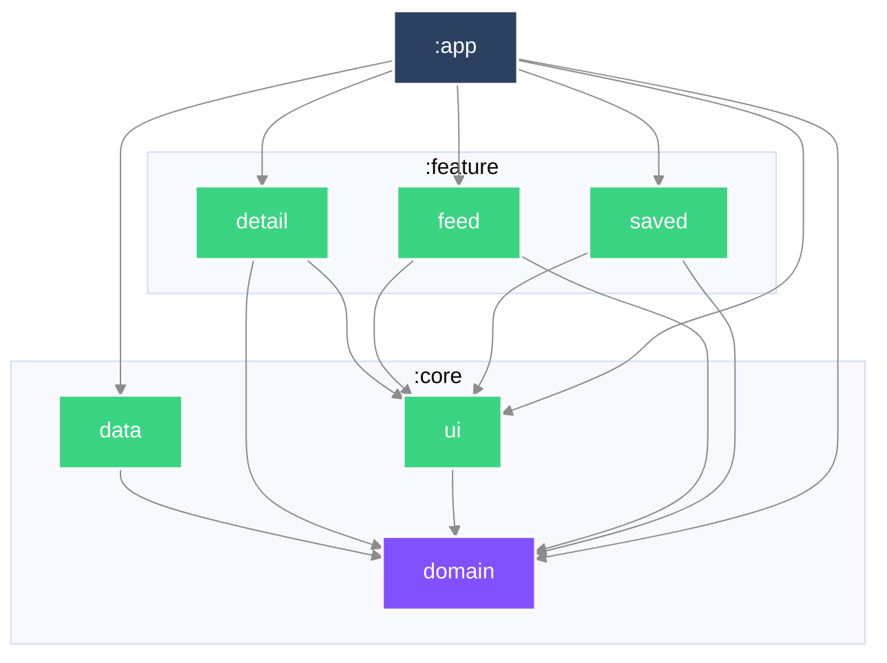

# Mosaic

A single feed assembled from sources that do not resemble each other — articles,
weather, films — each with its own idea of how quickly it goes stale.

> **Status: scaffolding.** The module structure, build gate, and working agreement are
> in place; no feature has been built yet. This README grows with the code, and says
> only what is true at each commit.

## Run it

```bash
./gradlew :app:installDebug
```

Builds from a clean checkout with no configuration step. Minimum SDK 24.

## How the code is arranged

| Module | Contains |
|---|---|
| `:core:domain` | Plain Kotlin. Models and repository interfaces. Depends on nothing. |
| `:core:data` | Network, persistence, mapping. Implements the domain's interfaces. |
| `:core:ui` | Design system and shared composables. |
| `:feature:feed` | The composed feed. |
| `:feature:detail` | A single article. |
| `:feature:saved` | Articles kept for offline reading. |
| `:app` | Wiring, navigation, and the Android entry point. |

Dependencies point inward. `:core:domain` is a plain Kotlin module with no Android
dependency at all, which is what stops a DTO or a Compose type from reaching it —
the build fails rather than a reviewer having to notice.

### Module graph



## Plan & sequencing

### How the problem was broken up

Into behaviours, one per commit — each independently reviewable and revertable. A
behaviour is something a user could notice, which is why the scaffolding commits are
labelled `build`/`ci`/`docs` rather than `feat`: they change nothing observable.

### The order, and why

1. **Scaffolding** — module boundaries first, because every file written before that
   decision would have to move afterwards.
2. **Articles feed** — one source, end to end, list to detail. Establishes the whole
   vertical slice on the simplest possible content before anything heterogeneous
   arrives.
3. **Offline saving** — persistence, on content whose shape has already settled.
4. **A heterogeneous feed** — weather and films joining the articles. This is deferred
   until last among the must-haves *on purpose*: it is the hardest abstraction, and
   choosing it before there is real content to generalise from would mean designing
   against a guess.
5. **Freshness** — per-source staleness, including backing off on metered networks.

### What was deliberately deferred

To be filled in as it happens, rather than reconstructed at the end.

## How this was built

`AGENTS.md` describes the development loop and the human/AI split this project runs on.
[`DECISIONS.md`](DECISIONS.md) records the choices a reviewer would question.
[`AI_USAGE.md`](AI_USAGE.md) records what the agent produced and what was rejected.
[`docs/git-conventions.md`](docs/git-conventions.md) covers commits and branches.