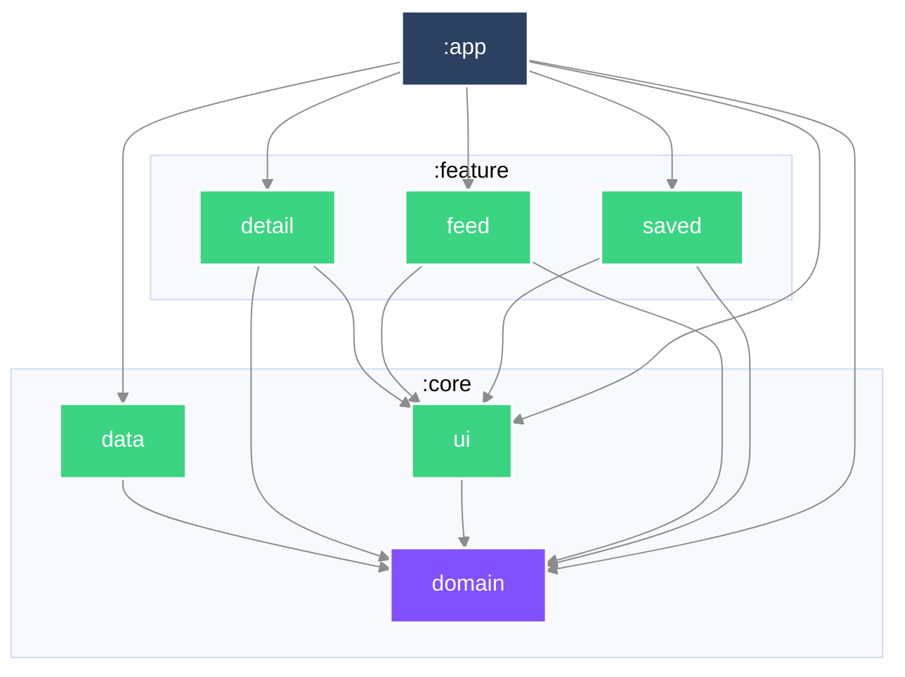

# Mosaic

一份由彼此不相像的來源組成的 feed——文章、天氣、電影——每一種對「多久算過期」
都有自己的看法。

> **目前狀態：文章 feed 的垂直切片已接通。** 裝起來會看到文章清單、往下捲會載入下一頁，
> loading／empty／error／offline 四種狀態各有自己的畫面。
> **尚未在實機驗證過**：所有證據來自單元測試與建置，畫面本身還沒有自動化測試（見下方延後表）。
> 還沒有的：離線儲存、異質內容、freshness、下拉更新。
> 這份 README 隨程式碼一起長，每個 commit 都只寫當下為真的事。

## 執行

```bash
./gradlew :app:installDebug
```

從乾淨的 checkout 直接建置，不需要任何設定步驟。最低支援 SDK 24。

## 程式碼怎麼擺

| 模組 | 內容 |
|---|---|
| `:core:domain` | 純 Kotlin。領域模型與 repository 介面。不相依於任何東西。 |
| `:core:data` | 網路、持久化、映射。實作 domain 宣告的介面。 |
| `:core:ui` | 設計系統與共用 composable。 |
| `:feature:feed` | 組合後的 feed。 |
| `:feature:detail` | 單篇文章。 |
| `:feature:saved` | 存起來離線閱讀的文章。 |
| `:app` | 組裝、導覽、Android 進入點。 |

相依方向一律向內。`:core:domain` 是純 Kotlin 模組、完全不相依 Android，
DTO 或 Compose 型別因此**進不去**——不是靠審查時有人注意到，是建置直接失敗。

### 模組相依圖


## 任務拆解與順序

### 怎麼拆

拆成「行為」，一個 commit 一個，每個都能獨立審查、獨立 revert。
行為指的是使用者感覺得到的改變——所以骨架那幾個 commit 標的是
`build`／`ci`／`docs` 而不是 `feat`：它們沒有改變任何可觀察的東西。

### 順序，以及為什麼

1. **骨架**——模組邊界先定，因為在它之前寫的每一個檔案事後都得搬家。
2. **文章 feed**——單一來源，從清單到內頁走完整條垂直切片。在異質內容進場之前，
   先用最單純的內容把整條路徑打通。
3. **離線儲存**——持久化，做在形狀已經穩定下來的內容上。
4. **異質 feed**——天氣與電影加入文章之中。它**刻意**排在 must-have 的最後：
   這是整份作業最難的抽象，而在還沒有真實內容可供歸納之前就先選定它，
   等於是對著猜測做設計。
5. **Freshness**——各來源各自的過期規則，包含在計費網路上退讓。

### 刻意延後了什麼

發生時當下補寫，而不是最後回頭重建。

| 延後的東西 | 為什麼現在不做 | 什麼時候做 |
|---|---|---|
| freshness 需要的 `updated_at` 與「本機何時抓的」 | 沒有行為在用的欄位是投機——加了也沒有測試能證明它對 | 跟著 freshness 那個行為一起進來 |
| 型別化的失敗（offline／HTTP 錯誤／回應無法解讀） | 轉換點在 repository，而 repository 還不存在 | repository 那個 commit |
| 自動重試 | 作業要求不浪費行動網路，而重試做錯正是最快的浪費方式 | 先有 freshness 與計費網路判斷，再談重試 |
| base URL 設定化 | 只有一個公開 endpoint，注入設定現在只會增加樣板 | 有第二個環境時 |
| 被丟掉的資料列要報給誰 | 原因已經帶回呼叫端，但只有數量被用到 | 有遙測或 log 的去處之後 |
| 畫面的自動化測試 | Compose 測試需要裝置或 Robolectric，兩者都還沒有；寫一個從未執行過的測試不算證據 | 接上 `connectedDebugAndroidTest` 或 Robolectric 之後 |
| `:core:ui` 裡真正的設計系統 | 目前它沒有任何 source，畫面直接用 `MaterialTheme`——模組相依是真的，內容不是 | 要嘛放進 `MosaicTheme`，要嘛拿掉那條相依 |
| 下拉更新 | 目前只有失敗畫面上的重試 | 有快取、知道「重新抓」的代價之後 |

## 這份專案是怎麼做出來的

[`AGENTS.md`](AGENTS.md) 描述開發迴圈，以及人與 AI 的分工落在哪裡。
[`DECISIONS.md`](DECISIONS.md) 記錄審查者會質疑的每一個選擇。
[`AI_USAGE.md`](AI_USAGE.md) 記錄 agent 實際產出了什麼、哪些被否決。
[`docs/git-conventions.md`](docs/git-conventions.md) 是 commit 與分支的慣例。